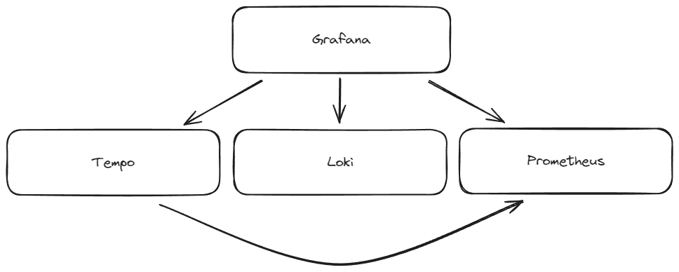

# Grafana OTEL Stack - Docker Compose - Example

## TL;DR

Run `docker compose --profile testing up -d` to start running with a local Azure Blob Storage.

To run against a proper Azure Blob Storage, update the pencil service with the `AZURE_ENDPOINT`, `AZURE_STORAGE_ACCOUNT` and `AZURE_STORAGE_KEY` of your storage account.

## Structure

The structure of this compose file is fairly simple. You have Grafana at the top, and the services for the different Telemetry types below. Tempo for traces, Loki for logs and Prometheus for metrics.

The line between Tempo and Prometheus is so Tempo's own telemetry data can be captured.

## Scalability

// TODO

## Suggestions / Contributions

// TODO